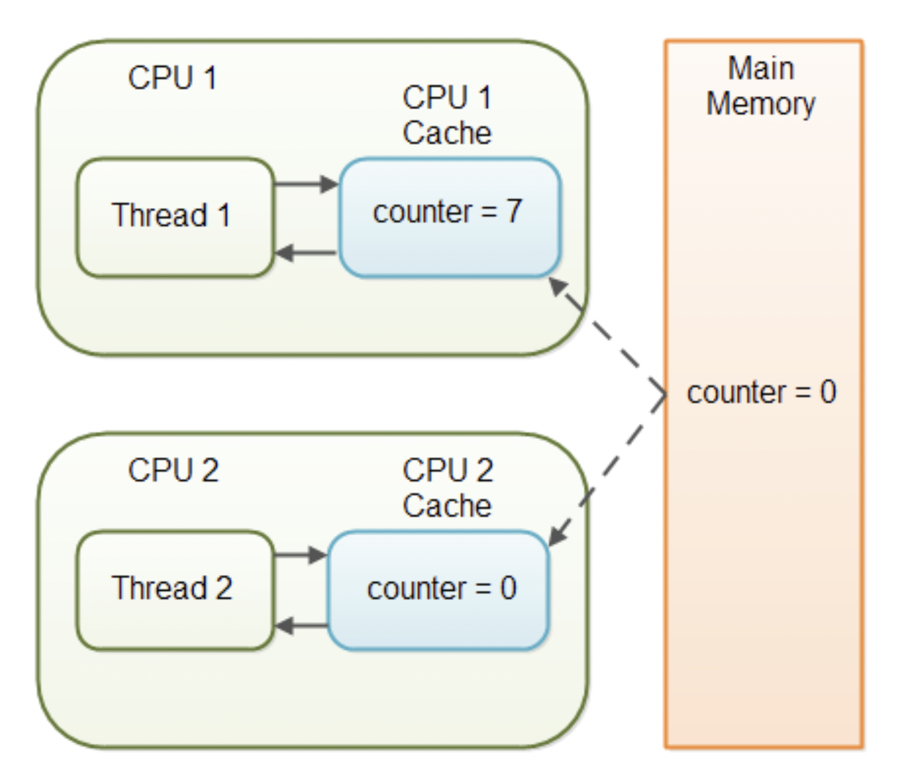

# Java에서 동시성 제어

 

소스코드의 특정 블럭을 동기화시키고자 할 때, 항상 메모리 가시성(Memory Visibility) 문제가 발생한다. 특정 변수의 값을 사용하고 있을 때 다른 스레드가 그 변수의 값에 접근하지 못하도록 막아야 하는 **상호배제(Mutual exclusion)**도 중요하지만 값을 수정한 다음 동기화 블록을 빠져나가고 나면 다른 스레드가 변경된 값을 즉시 사용할 수 있어야 하는 **가시성(Visibility)**도 중요하다.

## 가시성(**Visibility**)

싱글 스레드 환경에서는 프로그램의 코드가 특정 변수에 값을 수정한 다음 다시 그 변수의 값에 접근해보면 이전에 수정한 값을 다시 가져올 수 있다. 멀티 스레드 환경에서는 반드시 수정한 값을 읽는 것이 보장되지는 않는다. 공유 변수에 대해서 어떤 스레드가 값을 수정했을 때, 그 값을 다른 스레드가 읽어갈 수 있다는 보장이 없다. 수정하기 전 변수 값을 읽거나 심지어 값을 읽어가지 못할 수도 있다.

멀티프로세서에서 Stale Data 현상

Thread는 동작하는 시점에 하나의 CPU Core를 점유하고 동작을 한다. 선언한 변수의 값이 Memory에만 존재하는 것이 아니라 CPU Cahce라고 하는 영역에도 존재한다. 이는 CPU가 Memory에서 값을 읽어들여오고 다시 쓰고 하는 시간을 아끼기 위함이다. 더 큰 문제는 CPU Cache에 값이 Memory에 언제 옮겨갈지도 모른다는 것이다. 이를 해결하는 것을 **가시성**이라고 한다.

### Volatile 변수와 가시성

Cache에서 메인 메모리로 값이 쓰는 것을 다른 책이나 문서에서는 **flush**라고 표현한다. `volatile`은 `volatile`로 선언된 변수의 수정사항을 **CPU에서 바로 메모리로 바로 flush하여 가시성을 확보한다.  하지만**`volatile` 변수는 연산의 원자성을 보장하지 않는다. `volatile` 변수는 연산의 원자성은 보장하지 못하고 가시성만 보장한다.

 

---
## Atomic

이 외에도 동시성을 제어하기 위한 방법으로 **Synchronized** 키워드와 **Atomic**을 활용한 방식이 있다. Synchronized는 메소드 영역에 설정해서 메소드 자체를 임계 영역(Critical Section)으로 설정해 동시 진입을 못하게 하는 방식이다. 진입 자체를 막는 방식이기 때문에 대기 시간으로 인한 속도 이슈가 발생한다. 어떤 Thread는 Lock을 확보하느라 또 다른 Thread는 Lock을 확보하지 못해 Blocking 상태로 들어가느라 그리고 이 상태가 변경되는 동안 많은 시스템 자원이 쓰인다고 한다. (Context Switching 비용) 결국 이 문제는 성능문제로 이어진다.

**가장 좋은 방법은 Atomic이다.** Compare-And-Swap(CAS) 알고리즘 방식을 사용한다. CAS는 Compare-And-Swap의 줄임말로 말 그대로 비교하고 변경하는 방식이다. 동작원리는 다음과 같다.

- 인자로 기존 값과 변경할 값을 전달한다.
- 기존값으로 던진 값이 현재 시스템이 가지고있는 값과 같다면 변경할 값을 반영해준다. 반환값으로 true를 리턴한다.
- 반대로 기존값으로 던진 값이 현재 시스템이 가지고있는 값과 다르다면 값을 반영하지 않고 false를 리턴한다.
