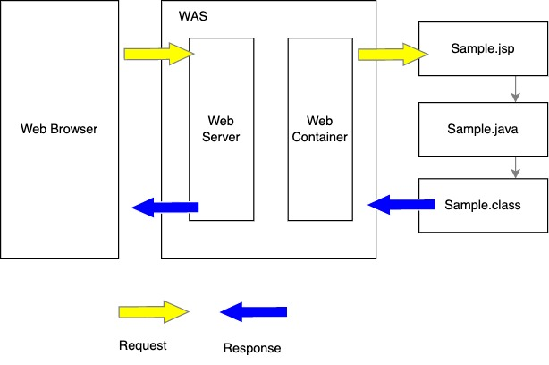

## 서블릿의 정의

**서블릿을 정의하자면 Dynamic Web Page를 만들 때 사용되는 자바 기반의 웹 애플리케이션 프로그래밍 기술이다.** 웹을 만들때는 다양한 요청(Request)과 응답(Response)이 있기 마련이고 이 요청과 응답에는 규칙이 존재한다. 이러한 HTTP 요청과 응답을 개발자가 일일이 파싱하고 불러오기는 간단한 일이 아니다. **서블릿은 이러한 웹 요청과 응답의 흐름을 간단한 메서드 호출만으로 체계적으로 다룰 수 있게 해주는 기술**이라고 생각하시면 이해하면 된다.

<br/>

### 서블릿의 예제

```java
@WebServlet("/hello")
public class HelloServlet extends HttpServlet {

	private static final long serialVersionUID = 1L;
       
	public HelloServlet() {
		super();
	}

	protected void doGet(HttpServletRequest request, HttpServletResponse response) 
    	throws ServletException, IOException {
		
		response.setContentType("text/html;charaset=utf-8");
		PrintWriter out = response.getWriter();
		out.println("<h1>Welcome to HelloWorld!</h1>");
		out.close();
	}

	protected void doPost(HttpServletRequest request, HttpServletResponse response) 
    	throws ServletException, IOException {		
		doGet(request, response);
	}
}
```

<br/>

## JSP 처리과정



**JSP에 해당하는 서블릿이 존재하지 않을 경우**

1. 웹 컨테이너는 JSP에 상응하는 서블릿이 존재하지 않을 경우 JSP페이지를 서블릿 자바소스 파일로 변환한다.
2. JSP페이지(.jsp)를 서블릿 프로그램(.java)으로 변환한다.
3. 서블릿 프로그램(.java)을 컴파일하여 서블릿 클래스(.class)를 생성한다.
4. 해당 서블릿 클래스에 클라이언트의 요청을 전달한다.
5. 서블릿 클래스가 처리한 결과를 응답으로 생성한다.
6. 응답을 웹 브라우저에 전송한다.

**JSP에 해당하는 서블릿이 존재하는 경우**

1. 해당 서블릿 클래스에 클라이언트의 요청을 전달한다.
2. 서블릿 클래스가 처리한 결과를 응답으로 생성한다.
3. 응답을 웹 브라우저에 전송한다.

여기서 중요한 것을 JSP 페이지를 요청할 때에는 JSP를 직접 실행하는 것이 아니라 **JSP를 자바 소스코드로 변환한 뒤 컴파일해서 생성한 서블릿(클래스)을 실행하는 것**이다.

<br/>

## Reference

[참고: Tistory [Web] 서블릿(Servlet)이란 무엇인가? 서블릿 총정리](https://coding-factory.tistory.com/742)