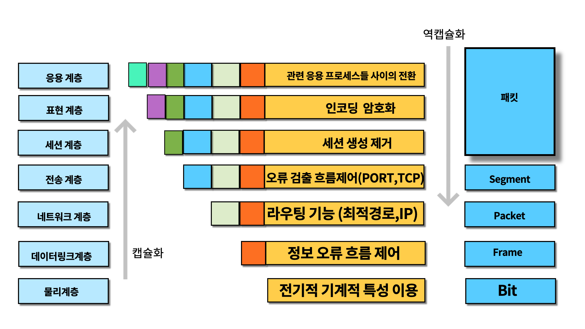
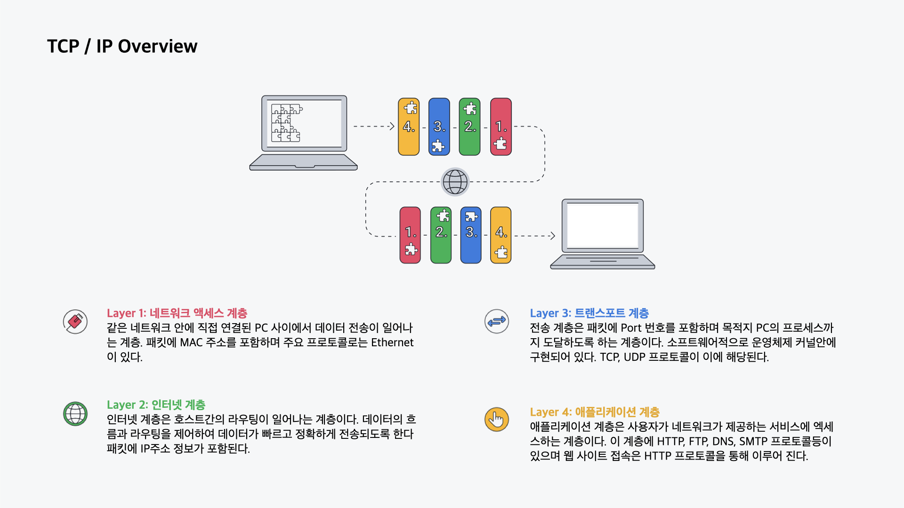

# OSI 7계층

 

## 애플리케이션 계층 (Application layer)

사용자가 사용하는 프로그램들을 '응용프로그램'이라고 한다. 또한 일반적으로 사용하는 앱이라는 말은 영어단어 'application'에서 온 것이다. 그래서 응용계층은 우리가 사용하는 웹 브라우저, 어플 등등에서 하는 사용자와 직접 맞닿아 있는 계층이다. 

 

## 프레젠테이션 계층 (Presentation layer)

다음으로 표현 계층은 말그대로 응용계층에서 내린 명령, 발송한 데이터 등을 어떻게 표현할지 정해주는 계층이다.

- **암호화**: 암호가 설정되어있으면 이 자료는 암호를 해석해야한다 알려준다.
- **인코딩**: 언어가 중국어로 작성이 되었으면 영어가 아니라 중국어로 읽어야 함을 알려준다.
- **압축** : 해당 자료가 압축이 되어있다면 압축해제가 필요함을 알려준다.

이와같이 자료를 받는 상대방도 보내는 사람의 의도대로 자료를 확인하기 위해 공통된 양식으로 표현을 하는 계층이라고 할 수 있다. 편지를 발송할 때 상대방으로 하여금 이 편지가 중국어인지 영어인지, 암호로적힌 건지 텍스트로 적힌 건지 등을 알려주는 계층이다.

 

## 세션 계층 (Session layer)

세션 계층은 **'연결'을 담당하는 계층**이다.연결을 생성(created), 유지(establish), 종료(close)를 관리하는 층이다.연결 방식에는 한쪽만 전달이 가능한 단방향, 무전기와 같이 한쪽이 연락을 할 때는 상대방이 연락을 할 수 없는 반이중, 전화와 같이 동시에 전달이 가능한 전이중이 있다.

 

## 트랜스포트 계층 (Transport layer)

전송계층은 전송을 위해서 **포트번호를 정하는 계층**이다. 포트는 전송할 대상이 누구인지 파악하는 것이라 생각할 수 있습니다. 이와 더불어 TCP / UDP 중 어떤 방식을 사용할지 결정한다.

- **포트번호 설정**
- **TCP / UDP**

 

## 네트워크 계층 (Network layer)

네트워크 계층에서는 **도착할 곳까지 어떤 경로(IP)로 가야할지 안내를 해주는 계층**이다. 이 때 사용되는 것이 IP입니다.

> 서울특별시 마포구 월드컵북로 000
> 

위 주소에서 편지가 적절히 목적지를 찾아가기 위해서는 서울특별시 -> 마포구 -> 월드컵북로(DMC)에 과정을 거쳐서 방문을 하는 것이 가장 적절할 것이다. 저 주소 자체는 IP라 하고 그 찾아가는 최단 경로는 **라우팅**을 통해서 확인할 수 있다.

- **IP 주소**
- **라우팅 알고리즘**

 

## 데이터링크 계층 (Datalink layer)

데이터링크 계층에서는 주소의 **아파트의 호수에 해당하는 MAC(media access control)이라는 고유주소를 확인 가능**하다. 맥 주소는 하드웨어에 보유된 고유한 번호로 중복되거나 변경되서는 안된다. 

- **MAC 주소**

 

## 물리 계층 (Physical layer)

0과 1로 되어있는 데이터를 전기신호로 바꿔주는 계층이다. 이를 통해 전선을 통해서 정보가 전달이 된다. 물리계층에서는 0과1로 데이터가 구성이 되어서 데이터단위는 'bit'이다.