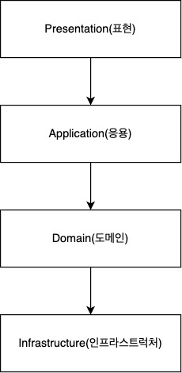

## 계층 구조 아키텍처

계층 구조 아키텍처(Layered Architecture)는 시스템을 책임과 성격을 구분하는 계층으로 분리하여 설계하는 구조를 가리킨다. 계층 구조는 그 특성상 상위 계층에서 하위 계층으로의 의존만 존재하고 하위 계층은 상위 계층에 의존하지 않는데, 가장 전형적인 계층 구조는 아래 그림과 같다.

위 그림 처럼 표현 계층은 응용 계층에 의존하고 응용 계층이 도메인 계층에 의존하지만, 반대로 인프라스트럭처 계층이 도메인에 의존하거나 도메인이 응용 계층에 의존하지 않는다.

 

### 표현 계층

→ 사용자에게 정보를 보여주고 명령을 해석하는 일을 책임진다. 스프링에서 컨트롤러에 해당하는 계층이다. 간혹 사람이 아닌 다른 컴퓨터 시스템이 외부 행위자가 되기도 한다. 

 

### 응용 계층

→ 이 계층에서 책임지는 작업은 비즈니스상 중요하거나 다른 시스템의 응용 계층과 상호작용하는데 필요한 것들이다. 스프링에서 서비스에 해당하는 계층이다. 여기에는 업무 규칙이나 지식이 포함되지 않으며, 오직 작업을 조정하고 아래에 위치한 계층에 포함된 도메인 객체의 협력자에게 작업을 위임한다. 응용 계층에서는 업무 상황을 반영하는 상태가 없지만 사용자나 프로그램의 작업에 대한 진행상황을 반영하는 상태를 가질 수는 있다.

 

### 도메인 계층

→ 업무 개념과 업무 상황에 관한 정보, 업무 규칙을 표현하는 일을 책임진다. 이 계층에서는 업무 상황을 반영하는 상태를 제어하고 사용하며, 그와 같은 상태 저장과 관련된 기술적인 세부사항은 인프라스트럭처에 위임한다. 이 계층은 업무용 소프트웨어의 핵심이다.

 

### 인프라스트럭처

→ 상위 계층은 지원하는 일반화된 기술적 기능을 제공한다. 이러한 기능에는 애플리케이션에 대한 메시지 전송, 도메인 영속화, UI 위젯을 그리는 것 등이 있다.

 
 

## Reference

에릭 에반스, **『도메인 주도 설계』**, 위키북스(2011), p71-.
최범균, **『도메인 주도 개발 시작하기』**, 한빛미디어(2022), p65-.