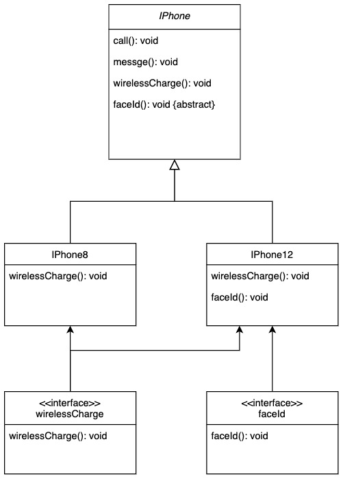
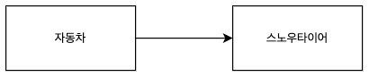
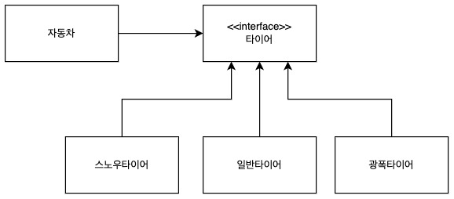

### OOP에서의 SOLID 원칙

- SRP: 단일 책임 원칙, **객체는 단 하나의 책임만 가져야 한다.**
- OCP : 개방-폐쇄 원칙, **확장에는 열려있느나 변경에는 닫혀있어야 한다.**
- LSP : 리스코프 치환 원칙, **하위 클래스는 언제나 자신의 상위 클래스타입으로 대체할 수 있어야 한다.**
- ISP : 인터페이스 분리 원칙, **클래스는 자신과 관련 없는 인터페이스는 구현하지 않는다.**
- DIP : 의존 역전 원칙, **상위 모듈은 하위 모듈에 종속 되면 안되고, 둘 다 추상화에 의존해야 한다.**

<br/><br/>

### SRP : **객체는 단 하나의 책임만 가져야 한다.**

**단일 책임 원칙이란** 한 클래스는 하나의 책임만 가져야 한다는 원칙이다. 예를들어 Developer라는 클래스가 있다고 가정해보자.

```java
public class Developer {
    private final static boolean BACKEND = true;
    private final static boolean FRONTEND = false;
    private final boolean role;

    public void work() {
        if (this.role == BACKEND) {
            // 서버개발
        } else { 
           // 클라이언트 개발
        }
    }
}
```

`Developer` 클래스의 `work()` 메서드는 백엔드와 프론트엔드 개발자의 행위를 모두 구현하려고 하기 때문에, 단일 책임 원칙을 위반하고 있다. 

이를 개선하기 위해 해당 클래스를 `Developer` 클래스를 상속하는`BackendDeveloper`와 `FrontendDeveloper` 클래스로 분리한다면 분기문을 사용할 필요가 없으며, 단일책임 원칙을 지킬 수 있다.

```java
// 추상클래스 선언
abstract class Developer {

    class Backend extends Developer {
      public void work() {
        // 서버개발 
      }
    }
    class Frontend extends Developer {
      public void work() {
        // 클라이언트 개발 
      }
    }
}
```

위와 같이 역할에 따라 클래스를 분리해 놓으면, 백엔드 개발자의 역할이 바뀐다고 해도 `FrontendDeveloper` 클래스에는 전혀 영향이 가지 않는다. 이처럼 변경이 있을 때 파급 효과가 적다면 단일 책임 원칙을 잘 따른 것이라고 판단할 수 있다.

<br/><br/>

### OCP: **확장에는 열려있느나 변경에는 닫혀있어야 한다.**

**개방-폐쇄원칙**이란 소프트웨어의 요소(클래스, 모듈, 함수 등)는 확장에는 열려있으나 변경에는 닫혀있어야 한다는 원칙이다. 할인정책을 구현한 예시를 보면 더 쉽게 이해할 수 있다.

```java
// 할인정책 '역할'을 정의한 DiscountPolicy. 할인정책이 새로 추가될때 마다 구현체를 정의한다.
public interface DiscountPolicy {
    int discount(int price);
}

// DiscountPolicy의 1번째 구현체 FixDiscountPolicy는 고정금액을 할인하는 정책이다.
public class FixDiscountPolicy implements DiscountPolicy{

    private int discountFixAmount = 1000; // 1000원 할인

    @Override
    public int discount(int price) {
      return price - discountFixAmount;
    }
}

// DiscountPolicy의 2번째 구현체 RateDiscountPolicy는 비율로 할인하는 정책이다.
public class RateDiscountPolicy implements DiscountPolicy {

    private int discountPercent = 10; // 10% 할인

    @Override
    public int discount(int price) {
        return price * discountPercent / 100;
    }
}

```

```java
public interface OrderService {
    Order createOrder(String itemName, int itemPrice);
}

public class OrderServiceImpl implements OrderService {
    private final DiscountPolicy discountPolicy;

    public OrderServiceImpl(DiscountPolicy discountPolicy) {
        this.discountPolicy = discountPolicy;
    }

    @Override
    public Order createOrder(String itemName, int itemPrice) {
        int discountPrice = discountPolicy.discount(itemPrice);

        return new Order(memberId, itemName, itemPrice, discountPrice);
    }
}
```

`DiscountPolicy` 인터페이스가 존재하고 `FixDiscountPolicy`, `RateDiscountPolicy` 등의 구체적인 연산을 구현한 클래스가 `DiscountPolicy` 인터페이스를 구현하는 방식으로 설계한다면, 추가적인 연산이 생겨 클래스를 확장하더라도 `OrderServiceImpl` 클래스의 코드는 변경할 필요가 없다. 이와같이 다형성을 활용하면 새로운 기능이 추가될 때 기존에 사용하던 인터페이스를 구현한 새로운 클래스를 만들어주기만 하면 된다. 따라서 유연성, 재사용성, 유지보수성 등 객체지향 프로그래밍의 장점을 제대로 누리기 위해서는 개방-폐쇄 원칙 준수가 필수적이다.

<br/><br/>

### LSP: **하위 클래스는 언제나 자신의 상위 클래스타입으로 대체할 수 있어야 한다.**

- 하위 클래스 `is a kind of` 상위 클래스 : 하위 분류는 상위 분류의 한 종류이다.
- 구현 클래스 `is able to` 인터페이스 : 구현 분류는 인터페이스 할 수 있어야 한다.

LSP 원칙 위반 코드, 직사각형(Rectangle) - 정사각형(Sqaure)

```java
// Rectangle: 직사각형 클래스 V1
public class RectangleV1
{
    protected int width;
    protected int height;
    
    // 너비 get 함수
    public int getWidth()
    {
        return width;
    }
    
    // 높이 get 함수
    public int getHeight()
    {
        return height;
    }
    
    // 너비 set 함수
    public void setWidth(int width)
    {
        this.width = width;
    }
    
    // 높이 set 함수
    public void setHeight(int height)
    {
        this.height = height;
    }
    
    // 넓이 get 함수
    public int getArea()
    {
        return width * height;
    }
}
```

```java
// Square: 정사각형 클래스 V1
public class SquareV1 extends RectangleV1
{
    // 너비 set 함수 Overriding
    @Override
    public void setWidth(int width)
    {
        super.setWidth(width);
        super.setHeight(getWidth());
    }
    
    // 높이 set 함수 Overriding
    @Override
    public void setHeight(int height)
    {
        super.setHeight(height);
        super.setWidth(getHeight());
    }
}
```

```java
// Main: 메인 클래스
public class Main
{
    //메인 함수
    public static void main(String[] args)
    {
        Rectangle rec = new Square();
        rec.setWidth(10);
        rec.setHeight(5);
        
        System.out.println(rec.getArea());
    }
}

/*********** 출력 결과 ***********
25
*******************************/
```

넓이는 50이 아닌 25로 반환됐다. 마지막에 수행된 `rec.setHeight(5)` 으로 인해 너비/높이를 모두 5로 할당했다. 그러니 넓이는 25로 세팅이 된다. 즉, 이 클래스는 리스코프 치환 원칙에 위배되는 코드다.

사실 직사각형과 정사각형은 상속관계가 전혀 될 수 없다. 사각형의 특징을 서로 갖고있긴 하지만, **두 사각형 모두 사각형(도형)의 한 종류일 뿐으로, 하나가 다른 하나를 완전히 포함하지 못 하는 구조**다.

**그렇다면 어떻게 변경을 해야될까?**

답은 올바른 상속과 구현에 있다. 직사각형과 정사각형은 상속의 관계가 성립되기 어렵다. 따라서 이보다 더 상위 개념인 도형 클래스를 정의하고 정사각, 직사각형이 이를 상속받으면 될 것이다.

```java
// Shape: 사각형(도형) 클래스 

public class Shape
{
    protected int width;
    protected int height;
    
    // 너비 get 함수
    public int getWidth()
    {
        return width;
    }
    
    // 높이 get 함수
    public int getHeight()
    {
        return height;
    }
    
    // 너비 set 함수
    public void setWidth(int width)
    {
        this.width = width;
    }
    
    // 높이 set 함수

    public void setHeight(int height)
    {
        this.height = height;
    }
    
    // 넓이 get 함수
    public int getArea()
    {
        return width * height;
    }
}
```

```java
// RectangleV2: 직사각형 클래스 V2
class RectangleV2 extends Shape
{
    // RectangleV2 생성자 함수

    public RectangleV2(int width, int height)
    {
        setWidth(width);
        setHeight(height);
    }
}

// SquareV2: 정사각형 클래스 V2
class SquareV2 extends Shape
{
    // SquareV2 생성자 함수
    public SquareV2(int length)
    {
        setWidth(length);
        setHeight(length);
    }
}
```

```java
// 메인 클래스
public class Main
{
    // 메인 함수
    public static void main(String[] args)
    {
        Shape rec = new Rectangle(10, 5);
        Shape square = new Square(5);
        System.out.println(rec.getArea());
        System.out.println(square.getArea());
    }
}

/*********** 출력 결과 ***********
50 
25
*******************************/
```

위 예시처럼 리스코프 치환 원칙을 지키기 위해선 가급적  상위 클래스의 **일반 메소드를 그 의도와 다르게 오버라이딩하지 않는 것**이 중요하다.

<br/><br/>

### ISP: **클래스는 자신과 관련 없는 인터페이스는 구현하지 않는다.**

구현할 객체에게 무의미한 메소드의 구현을 방지하기 위해 반드시 필요한 메소드만을 상속/구현하도록 권고한다. 만약 상속할 객체의 규모가 너무 크다면, 해당 객체의 메소드를 작은 인터페이스로 나누는 것이 좋다.

아래 다이어그램은 IPhone 클래스 관계를 나타낸 그림이다.


예를 들어, `IPhone`이라는 클래스가 있다고 가정하자. 이 `IPhone` 클래스는 전화, 메시지 기능 외에도 무선 충전, Face ID 등의 기능을 포함하고 있다. 이를 가지고 `IPhone12`을 구현하면 `IPhone`의 동작 모두가 필요하므로 ISP원칙을 만족한다. 그러나 `IPhone8` 을 구현할 경우, 무선 충전, Face ID 같은 기능을 제공하지 않는다. 그럼에도 불구하고 상위 클래스인 `IPhone`에 이러한 인터페이스가 포함되어 있으므로, `IPhone8` 입장에서는 필요하지도 않은 기능을 구현해야하는 낭비가 발생한다.

공통된 기능을 제외한 기능은 인터페이스로 분리해서 구현할 수 있도록 설계한다.



인터페이스 분리 원칙은 객체가 반드시 필요한 기능만을 가지도록 제한하는 원칙이다. 불필요한 기능의 상속/구현을 최대한 방지함으로써 객체의 불필요한 책임을 제가한다. 큰 규모의 객체는 필요에 따라 인터페이스로 잘게 나누어 확장성을 향상시킨다.

객체를 상속할 땐 해당 객체가 상속 받는 객체에 적합한 객체인지, 의존적인 기능이 없는 지 판단하여 올바른 객체를 구현, 상속하도록 하자.

<br/><br/>

### DIP:  **상위 모듈은 하위 모듈에 종속 되면 안되고, 둘 다 추상화에 의존해야 한다.**

> *고차원 모듈은 저차원 모듈에 의존하면 안 된다. 이 두 모듈 모두 다른 추상화된 것에 의존해야 한다. 추상화된 것은 구체적인 것에 의존하면 안 된다. 구체적인 것이 추상화된 것에 의존해야 한다. 자주 변경되는 구체(Concrete) 클래스에 의존하지 마라. - 로버트 C.마틴 -*
> 

한마디로 추상화에 의존해야지 구체화에 의존하면 안 된다는 원칙이다.




예를 들어 자동차와 타이어의 관계를 생각해보자. 타이어는 소모품이고, 계절에 따라 교체될 수 있다. 이렇게 자주 바뀌는 것에 의존하면 자동차는 영향을 받게 되어 있다. 즉, 자동차 자신보다 더 자주 변하는 스노우타이어에 의존하기에 좋지 않음을 알 수 있다.



따라서 자동차와 타이어의 관계를 설정할 때 자동차가 스노우타이어라는 구체 클래스를 의존하게 하는 것보단, 스노우타이어, 일반타이어, 광폭 타이어가 구현하고 있는 타이어라는 클래스를 새로 정의하고, 자동차는 타이어 인터페이스를 의존하게 하는 것이 좋다. 인터페이스가 아닌 구현체에 의존하게 된다면 구현체의 유연한 변경이 어려워지기 때문에, 구현 클래스 또는 하위 클래스보다 변경 가능성이 낮은 인터페이스, 추상 클래스, 상위 클래스에 의존하는 것이 좋다.