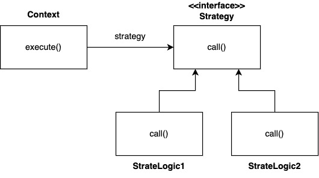

## Template Method Pattern (템플릿 메서드 패턴)

템플릿 메서드 패턴을 한줄로 요약하면 아래와 같이 요약할 수 있다.
*"상위 클래스의 견본 메서드에서 하위 클래스가 오버라이딩한 메서드를 호출하는 패턴”* 
예시 코드를 통해 살펴보자.

**Dog와 Cat의 추상화 클래스 Animal.java**

```java
package templateMethodPattern

public abstract class Animal {
	// 템플릿 메서드
	public void playWithOwner() {
		System.out.println("귀염둥이 이리온 .. ");

		// 상속하는 추상메서드 play()
		play();

		runSomething();
		System.out.println("잘했어");
	}

	// 추상 메서드
	abstract void play();

	// Hook 메서드
	void runSomething() {
		System.out.println("~ 꼬리 살랑 살랑");
	}

}
```

<br/>

**상속받은 Dog.java**

```java
package templateMethodPattern

public class Dog extends Animal {
	@Override
	// 추상 메서드 오버라이딩, 구현
	void play() {
		System.out.println("멍! 멍!");
	}

	@Override
	// Hook 메서드
	void runSomething() {
		System.out.println("멍! 멍!~ 꼬리 살랑 살랑");
	}

}
```

<br/>

**상속받은 Cat.java**

```java
package templateMethodPattern

public class Cat extends Animal {
	@Override
	// 추상 메서드 오버라이딩, 구현
	void play() {
		System.out.println("야옹~ 야옹~");
	}

	@Override
	// Hook 메서드
	void runSomething() {
		System.out.println("야옹~ 야옹~ 꼬리 살랑 살랑");
	}

}
```

<br/>

**클라이언트 코드 Client.java**

```java
package templateMethodPattern

public class Client {
	public static void main(String[] args) {
		Animal bolt = new Dog();
		Animal kitty = new Cat();

		bolt.playwithOwner();
		kitty.playwithOwner();

	}
}
```

템플릿 메서드 패턴의 구성요소 

- 템플릿 메서드 `playwithOwner()`
- 템플릿 메서드에서 호출하는 추상 메서드 `play()`
- 템플릿 메서드에서 호출하는 훅 메서드 - 하위클래스가 선택적으로 오버라이딩

템플릿 메서드는 다형성을 활용하여 변하는 부분(`play()`)과 변하지 않는 부분을 분리하는 방법이다.

<br/>
<br/>

## Strategy Pattern (전략 패턴)

템플릿 메서드 패턴은 부모 클래스에 변하지 않는 템플릿을 두고, 변하는 부분을 자식 클래스에 두어서 **상속**을 사용해서 문제를 해결했다. 전략 패턴은 변하지 않는 부분을 **Context** 라는 ****곳에 두고, 변하는 부분을 **Strategy** 라는 인터페이스를 만든 뒤, 해당 인터페이스를 구현하도록 해서 문제를 해결한다. 상속이 아니라 위임으로 문제를 해결한다는 것에서 차이점이 발생한다. 전략 패턴에서 **Context**는 변하지 않는 템플릿 역할을 하고 **Strategy**는 변하는 알고리즘 역할을 한다.

한편, GOF 디자인 패턴에서 정의한 전략 패턴의 의도는 다음과 같다.

*알고리즘 제품군을 정의하고 각각을 캡슐화하여 상호 교환 가능하게 만들자. 전략을 사용하면 알고리즘을 사용하는 클라이언트와 독립적으로 알고리즘을 변경할 수 있다.*

전략 패턴을 구성하는 세 요소는 아래와 같다.

- 전략 메서드를 가진 전략 객체
- 전력 객체를 사용하는 컨텍스트
- 전략객체를 생성해 컨텍스트에 주입하는 클라이언트

전략 패턴을 쉽게 이해하기 위해 군인을 예로 들어본다. 군인은 자신이 사용할 무기가 있고 그 무기는 보급 장교로 부터 무기를 지급받았다고 가정해보자. 이 내용을 전략 패턴에 따라 구분해보면 무기는 전략이 되고 군인은 컨텍스트, 보급 장교는 제 3자, 즉 클라이언트가 된다. 이를 자바 코드로 구현해보자.

<br/>

**전략 인터페이스를 나타내는 Strategy.java**

```java
package strategyPattern;

public interface Strategy {
	// 전략 메서드
	public abstract void runStrategy();
}
```

<br/>

**전략 인터페이스를 구현하는 StrategyGun.java**

```java
package strategyPattern;

public class StrategyGun implements Strategy {
	@Override
	public void runStrategy() {
		System.out.println("총소리");
	}
}
```

<br/>

**전략 인터페이스를 구현하는 StrategySword.java**

```java
package strategyPattern;

public class StrategySword implements Strategy {
	@Override
	public void runStrategy() {
		System.out.println("칼을 휘두르는 소리");
	}
}
```

<br/>

**전략 인터페이스를 구현하는 StrategyBow.java**

```java
package strategyPattern;

public class StrategyBow implements Strategy {
	@Override
	public void runStrategy() {
		System.out.println("활 쏘는 소리");
	}
}
```

<br/>

**전략을 사용하는 컨텍스트 Soldier.java**

```java
package strategyPattern;

public class Soldier {
	System.out.println("전투 시작");
	strategy.runStrategy();
	System.out.println("전투 종료");
}
```

<br/>

**전략  패턴의 클라이언트 Client.java**

```java
package strategyPattern;

public class Client {
	public static void main(Stirng[] args) {
		Strategy strategy = null;
		Soldier rambo = new Soldier();

		// Gun
		strategy = new StrategyGun();
		rambo.runContext(strategy);
		
		System.out.println();

		// Sword
		strategy = new StrategySword();
		rambo.runContext(strategy);
		
		System.out.println();

		// Bow
		strategy = new StrategyBow();
		rambo.runContext(strategy);
		
	}
}
```

```java
// 실행 결과
전투 시작
총소리
전투 종료

전투 시작
칼을 휘두르는 소리
전투 종료

전투 시작
활 쏘는 소리
전투 종료
```

위 코드 처럼 전략을 다양하게 변경하면서 컨텍스트를 실행할 수 있다. 전략 패턴은 템플릿 메서드 패턴하고도 약간 비슷한 모습인데, 사용자는 같은 문제의 해결책으로 상속을 이용하는 템플릿 메서드 패턴과 객체 주입을 통한 전략 패턴중에서 선택할 수 있다. 다만, 단일 상속만이 가능한 자바에서는 상속이라는 제한이 있는 템플렛 메서드 패턴보다는 전략 패턴이 조금 더 많이 활용된다.

<br/>
<br/>

## Strategy Pattern 실전 예제



<br/>

**Strategy.java**

```java
public interface Strategy {
    void call();
}
```

<br/>

**StrategyLogic1.java**

```java
import lombok.extern.slf4j.Slf4j;

@Slf4j
public class StrategyLogic1 implements Strategy {
	@Override
	public void call() {
		log.info("비즈니스 로직1 실행"); 
	}
}
```

<br/>

**StrategyLogic2.java**

```java
import lombok.extern.slf4j.Slf4j;

@Slf4j
public class StrategyLogic2 implements Strategy {
	@Override
	public void call() {
		log.info("비즈니스 로직2 실행"); 
	}
}
```

<br/>

**ContextV1.java**

```java
@Slf4j
	public class ContextV1 {
	
	private Strategy strategy;
	
	public ContextV1(Strategy strategy) {
		this.strategy = strategy;
	}

  public void execute() {
    long startTime = System.currentTimeMillis();
    //비즈니스 로직 실행
    strategy.call(); //위임
    //비즈니스 로직 종료
    long endTime = System.currentTimeMillis();
    long resultTime = endTime - startTime;
    log.info("resultTime={}", resultTime);
  }
}
```

<br/>

**Client 코드 1 - new 객체 생성**

```java
void strategyV1() {
	Strategy strategyLogic1 = new StrategyLogic1();
	ContextV1 context1 = new ContextV1(strategyLogic1);
	context1.execute();
	
	Strategy strategyLogic2 = new StrategyLogic2();
	ContextV1 context2 = new ContextV1(strategyLogic2);
	context2.execute();
}
```
<br/>

**Client 코드 1 - new 객체 생성**

```java
void strategyV1() {
	Strategy strategyLogic1 = new StrategyLogic1();
	ContextV1 context1 = new ContextV1(strategyLogic1);
	context1.execute();
	
	Strategy strategyLogic2 = new StrategyLogic2();
	ContextV1 context2 = new ContextV1(strategyLogic2);
	context2.execute();
}
```

<br/>

**Client 코드 2 - 익명 클래스 선언 후 객체 생성**

```java
void strategyV2() {
	Strategy strategyLogic1 = new Strategy() {
	  @Override
	  public void call() {
			log.info("비즈니스 로직1 실행");
	  }
	};
	ContextV1 context1 = new ContextV1(strategyLogic1);
	context1.execute();
	
	Strategy strategyLogic2 = new Strategy() {
	  @Override
	  public void call() {
			log.info("비즈니스 로직2 실행");
	  }
	};
	ContextV1 context2 = new ContextV1(strategyLogic2);
	context2.execute();
}
```

<br/>

**Client 코드 3 - 익명 클래스 선언과 동시에 생성**

```java
void strategyV3() {
	ContextV1 context1 = new ContextV1(new Strategy() {
    @Override
    public void call() {
      log.info("비즈니스 로직1 실행");
    }
	});
	context1.execute();
	
	ContextV1 context2 = new ContextV1(new Strategy() {
    @Override
    public void call() {
      log.info("비즈니스 로직2 실행");
    }
	});
	context2.execute();
}
```

<br/>

**Client 코드 4 - 람다함수 이용**

```java
void strategyV4() {
  ContextV1 context1 = new ContextV1(() -> log.info("비즈니스 로직1 실행"));
  context1.execute();

  ContextV1 context2 = new ContextV1(() -> log.info("비즈니스 로직2 실행"));
  context2.execute();
}
```

**실행결과**

```java
비즈니스 로직1 실행
resultTime=4
비즈니스 로직2 실행
resultTime=1
```

<br/>

`ContextV1` 은 변하지 않는 로직을 가지고 있는 템플릿 역할을 하는 코드이다. 전략 패턴에서는 이것을 **Context(문맥)**이라 한다. 쉽게 이야기해서 **Context(문맥)**는 크게 변하지 않지만, 그 문맥 속에서 `strategy`를 통해 일부 전략이 변경된다 생각하면 된다.

`ContextV1`는 내부에 `Strategy strategy` 필드를 가지고 있다. 이 필드에 변하는 부분인 `Strategy`의 구현체를 주입하면 된다. 전략 패턴의 핵심은 `ContextV1`는 `Strategy` 인터페이스에만 의존한다는 점이다. 덕분에 `Strategy`의 구현체를 변경하거나 새로 만들어도 `ContextV1` 코드에는 영향을 주지 않는다.